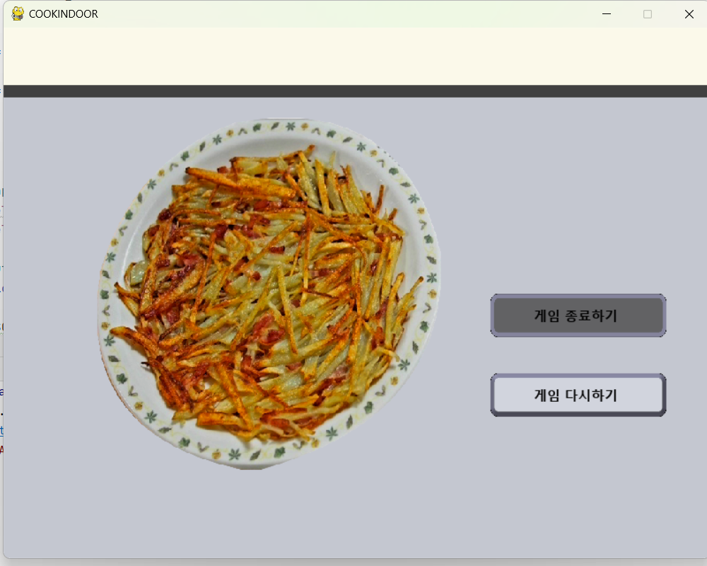

# CookIndoor
<p align="center">

</p>

CookIndoor는 openCV를 이용한 요리 시뮬레이션 게임입니다.

# Contents
* ### [Feature](#feature-1)
* ### [How to start?](#how-to-start-1)
* ### [How to play?](#how-to-play-1)
* ### [Describe the development process](#describe-the-development-process-1)
* ### [Demo video](#demo-video-1)

## [Feature](#feature)

<p align="center">

</p>

실제 요리법 바탕으로 게임을 구현하여 게임을 통해 레시피 익히는 게임입니다.

<p align="center">

</p>
누구나 할 수 있는 요리법을 사용하였고 손 동작을 활용하여 직접 요리합니다.


## [How to start?](#how-to-start)
### 환경 설정

먼저 캠을 사용할 수 있는 장치가 필요합니다.

#### pip install
```
pip install opencv
or
pip install opencv-python
```

```
pip install mediapipe
```
```
pip install numpy
```
```
pip install pygame
```

### 어플리케이션 시작

필요한 모듈들을 pip를 통해 모두 다운로드 받았다면 다음 코드를 실행하여 게임을 실행합니다.

```
python maingame.py
```

## [How to play?](#how-to-play)
* ## 게임 시작하기
#### 들어가기에 앞서

이 게임은 게임 모드에서만 openCV로 작동되며 그 외의 버튼은 모두 마우스로 작동합니다.

#### 포인터

이 게임은 가위, 바위, 보 3개의 모션을 인식합니다. 
손으로 가위 모양을 만들면 포인터가 칼 모양이 됩니다.
<p>
  
  
</p>


손으로 바위, 보자기 모양을 만들면 포인터가 손 모양이 됩니다.
<p>
  
  
  
</p>


#### 게임 진행 과정

<p align="center">

</p>

게임을 실행하면 시작화면에 메뉴 선택을 눌러주세요.
종료하고자 한다면 우측 하단에 있는 종료 버튼을 눌러주세요.


<p align="center">

</p>

**메뉴를 선택하세요**

4가지의 요리 중 원하는 메뉴를 선택한 후 게임 시작하기 버튼을 눌러주세요.
메뉴를 선택하지 않을 시에는 게임 시작하기 버튼이 활성화되지 않아요. 주의해주세요.

* ## 게임 모드

게임 모드에서는 메뉴마다 다른 게임 화면이 나와요. 크게 4가지 단계로 구분할 수 있으며 각각 섞는 과정, 전자레인지 돌리는 과정, 자르는 과정, 프라이팬으로 조리하는 과정, 냄비로 끓이는 과정이 있어요.

   * ### 섞기
<p align="center">

</p>


   * ### 전자레인지 돌리기
<p align="center">

</p>


   * ### 자르기
<p align="center">

</p>


   * ### 프라이팬
<p align="center">

</p>


   * ### 냄비
<p align="center">

</p>

냄비는 끓이는 과정을 나타내기 위해 추가한 장면으로 기다리면 그 다음 장면으로 넘어갑니다.

   * ### 요리
<p align="center">

</p>

요리가 끝나면 완성된 요리 사진과 함께 게임을 다시할 수 있는 버튼과 게임을 종료할 수 있는 버튼이 등장합니다.

## [Describe the development process](#describe-the-development-process)

### 1.메뉴 모드와 버튼 클래스 구현
#### 코드
```
def game():
    global MODE, TIME
    TIME = pg.time.get_ticks()
    if TIME > 4800:
        background(OPENINGTURNOFFIMG)
    if TIME > 5000:
        background(OPENINGIMG)
    if TIME > 7000:
        menu_trans = pg.transform.scale(MENUSELECT, [336, 150])
        menu_highlight_trans = pg.transform.scale(MENUSELECTHIGHLIGHT, [366, 185])
        menu_select_trans = pg.transform.scale(GAMESTARTBUTTON, [200, 50])
        menu_start = pg.transform.scale(STARTIMG, [800, 600])
        if MODE == 0:
            screen.blit(menu_start, [0, 0])
            draw_text("오늘은", screen, 230, 200, SUBGAMETITLEFONT, BLACK)
            draw_text("방구석 요리사", screen, 230, 240, GAMETITLEFONT, BLACK)
            Button(pg.transform.scale(GAMESTARTBUTTON, [300, 63]), 250, 310, 300, 63,
                   pg.transform.scale(GAMESTARTBUTTONPRESSED, [300, 63]), 250, 310, next_menu_select_scene)
            Button(pg.transform.scale(GAMEOVER, [50, 50]), 740, 540, 100, 100,
                   pg.transform.scale(GAMEOVER, [50, 50]), 740, 540, end)
            draw_text("메뉴 선택", screen, 340, 320, FONT, BLACK)
```
```
class Button():
    def __init__(self, img_in, x, y, width, height, img_act, x_act, y_act, action=None):
        self.img_in = img_in
        self.x = x
        self.y = y
        self.width = width
        self.height = height
        self.img_act = img_act
        self.x_act = x_act
        self.y_act = y_act
        self.action = action

        mouse = pg.mouse.get_pos()
        click = pg.mouse.get_pressed()
        if x + width > mouse[0] > x and y + height > mouse[1] > y:
            screen.blit(img_act, (x_act, y_act))
            if click[0] and action is not None:
                time.sleep(0.1)
                action()
        else:
            screen.blit(img_in, (x, y))
```
#### 세부사항
* 5초 뒤에 게임 실행, 불이 꺼졌다 켜지는 모션을 구현
* Button 클래스의 action 부분으로 함수를 실행시키는 동작을 구현

### 2. Cookmode class 기본 틀 구현
```
class Cookmode():
    def __init__(self, COOKMODE, surface):
        self.surface = surface

        if COOKMODE == 1:
            self.fried_rice()
        elif COOKMODE == 2:
            self.jjajang()
        elif COOKMODE == 3:
            self.topped_rice()
        elif COOKMODE == 4:
            self.potato_pancake()

    def caption_in(self, caption, font=FONT):
        self.caption = font.render(caption, False, IVORY, BLACK)
        self.caption_position = self.caption.get_rect()
        self.caption_position.centerx = 400
        self.caption_position.y = 500
        self.surface.blit(self.caption, self.caption_position)
    
    def caption_two(self, caption, font=FONT):
        self.caption = font.render(caption, False, IVORY, BLACK)
        self.surface.blit(self.caption, (100, 700))

    def explain(self, image):
        background(image)
        pg.display.update()
        pg.time.delay(1500)
```
#### 세부사항
* COOKMODE를 변경함으로써 COOKMODE의 숫자에 따라 다른 음식이 나오도록 설계
* caption_in, explain 함수를 추가함으로써 플레이어에게 정보 제공
```
def fried_rice(self):
        global EXPLANATION
        if EXPLANATION:
            self.explain(STIR_EX)
            self.explain(CUT_EX)
            self.explain(MICRO_EX)
            EXPLANATION = False
        if MAKEUPMODE == 1:
            self.stir(FRIEDRICE1)
        elif MAKEUPMODE == 2:
            self.cut(FRIEDRICE2)
        elif MAKEUPMODE == 3:
            self.stir(FRIEDRICE3)
        elif MAKEUPMODE == 4:
            self.micro(FRIEDRICE4)
        else:
            self.finish()

    def jjajang(self):
        global EXPLANATION
        if EXPLANATION:
            self.explain(STIR_EX)
            self.explain(MICRO_EX)
            EXPLANATION = False
        if MAKEUPMODE == 1:
            self.stir(JJAJANG1)
        elif MAKEUPMODE == 2:
            self.micro(JJAJANG2)
        elif MAKEUPMODE == 3:
            self.stir(JJAJANG3)
        elif MAKEUPMODE == 4:
            self.micro(JJAJANG4)
        else:
            self.finish()

    def topped_rice(self):
        global EXPLANATION
        if EXPLANATION:
            self.explain(CUT_EX)
            self.explain(PAN_EX)
            EXPLANATION = False
        if MAKEUPMODE == 1:
            self.cut(TOPPEDRICE1)
        elif MAKEUPMODE == 2:
            self.cut(TOPPEDRICE2)
        elif MAKEUPMODE == 3:
            self.pan(TOPPEDRICE3)
        elif MAKEUPMODE == 4:
            self.pot(TOPPEDRICE4)
        else:
            self.finish()

    def potato_pancake(self):
        global EXPLANATION
        if EXPLANATION:
            self.explain(CUT_EX)
            self.explain(PAN_EX)
            EXPLANATION = False
        if MAKEUPMODE == 1:
            self.cut(POTATOPANCAKE1)
        elif MAKEUPMODE == 2:
            self.pan2(POTATOPANCAKE2, POTATOPANCAKE3)
        else:
            self.finish()
```
#### 세부사항
* MAKEUPMODE를 변경함으로써 인게임 씬 넘기기

### 3. mediapipe를 이용한 인식, 검지 끝을 기준으로 포인터 움직이도록 설계
```
 rps_gesture = {6: 'rock', 5: 'paper', 9: 'scissors', 1: 'scissors', 0: 'rock', 3: 'scissors'}

    hands = mp_hands.Hands(max_num_hands=max_num_hands,
                           min_detection_confidence=0.5,
                           min_tracking_confidence=0.5)

    file = np.genfromtxt('data/gesture_train.txt', delimiter=',')
    angle = file[:, :-1].astype(np.float32)
    label = file[:, -1].astype(np.float32)
    knn = cv2.ml.KNearest_create()
    knn.train(angle, cv2.ml.ROW_SAMPLE, label)
```
```
if IDX in rps_gesture.keys():
    cv2.putText(image, text=rps_gesture[IDX].upper(),
            org=(int(hand_landmarks.landmark[0].x * image.shape[1]),
            int(hand_landmarks.landmark[0].y * image.shape[0] + 20)),
            fontFace=cv2.FONT_HERSHEY_SIMPLEX, fontScale=1, color=(125, 125, 125), thickness=2)

px = joint[7][0] * (WIDTH) + 0
py = joint[7][1] * (HEIGHT) + 0
JOINTPOS = [px, py]

if INGAMEMODE == 1 and ENDMODE == 0:
    if IDX == 9 or IDX == 3 or IDX == 1:
        screen.blit(pg.transform.scale(KNIFE_POINTER, [79, 93]), JOINTPOS)
    else:
        screen.blit(pg.transform.scale(NORMAL_POINTER, [79, 93]), JOINTPOS)
```
#### 세부사항
* knearest 알고리즘을 통해 knn변수를 gesture_train을 통해 학습시킴
* 검지를 기준으로 px, py 설정. 가위 모양일 경우 포인터 knife_pointer로 전환

### 4. 인게임 기능(stir(젓기) 구현)
```
def stir(self, caption):  # 재료만 변경 매개변수에 ingredient
        global STIR_OUT, MAKEUPMODE, STIR_COUNT, MICRO_DONE
        MICRO_DONE = False

        background(STIR)
        self.caption_in(caption)

        self.stir_ground = pg.Rect((200, 0, 400, 200))
        if self.stir_ground.collidepoint(JOINTPOS) and IDX == 0:
            background(STIR_GIF[STIR_COUNT])
            STIR_COUNT += 1
            if STIR_COUNT >= 60:
                STIR_COUNT = 0
            STIR_OUT = True
        if JOINTPOS[1] > 200:
            STIR_OUT = False
        if (JOINTPOS[0] < 200 or JOINTPOS[0] > 600) and STIR_OUT and IDX == 0:
            time.sleep(1)
            STIR_COUNT = 0
            MAKEUPMODE += 1
```
#### 세부사항
* 이미지를 60개로 나눠서 애니메이션이 작동하는 것처럼 보이도록 설계


### 5. 인게임 기능(cut(자르기) 구현)
```
def cut(self, caption):  # 재료만 변경 매개변수에 ingredient
        global CUT_OUT, MAKEUPMODE, NUMBER_OF_CUT_INGREDIENTS, ISCUT

        ISCUT = True
        background(CUT)
        self.caption_in(caption)

        if COOKMODE == 1:
            self.onion_ground = pg.Rect((350, 200, 200, 200))
            if NUMBER_OF_CUT_INGREDIENTS == 1:
                self.surface.blit(ONION_1, [300, 150])
            if NUMBER_OF_CUT_INGREDIENTS == 2:
                self.surface.blit(ONION_2, [300, 150])
            if NUMBER_OF_CUT_INGREDIENTS == 3:
                self.surface.blit(ONION_3, [300, 150])
            if self.onion_ground.collidepoint(JOINTPOS) and (IDX == 9 or IDX == 3 or IDX == 1):
                CUT_OUT = True
            if (JOINTPOS[1] > 400 or JOINTPOS[1] < 200) and CUT_OUT and (IDX == 9 or IDX == 3 or IDX == 1):
                NUMBER_OF_CUT_INGREDIENTS += 1
                time.sleep(1)
                CUT_OUT = False
                if NUMBER_OF_CUT_INGREDIENTS > 3:
                    ISCUT = False
                    NUMBER_OF_CUT_INGREDIENTS = 1
                    MAKEUPMODE += 1

        if COOKMODE == 3 and MAKEUPMODE == 1:
            self.green_onion_ground = pg.Rect((350, 250, 200, 100))
            if NUMBER_OF_CUT_INGREDIENTS == 1:
                self.surface.blit(GREEN_ONION_1, [300, 200])
            if NUMBER_OF_CUT_INGREDIENTS == 2:
                self.surface.blit(GREEN_ONION_2, [300, 200])
            if NUMBER_OF_CUT_INGREDIENTS == 3:
                self.surface.blit(GREEN_ONION_3, [300, 200])
            if NUMBER_OF_CUT_INGREDIENTS == 4:
                self.surface.blit(GREEN_ONION_4, [300, 200])
            if self.green_onion_ground.collidepoint(JOINTPOS) and (IDX == 9 or IDX == 3 or IDX == 1):
                CUT_OUT = True
            if (JOINTPOS[1] > 400 or JOINTPOS[1] < 200) and CUT_OUT and (IDX == 9 or IDX == 3 or IDX == 1):
                NUMBER_OF_CUT_INGREDIENTS += 1
                time.sleep(1)
                CUT_OUT = False
                if NUMBER_OF_CUT_INGREDIENTS > 4:
                    ISCUT = False
                    NUMBER_OF_CUT_INGREDIENTS = 1
                    MAKEUPMODE += 1

        if COOKMODE == 3 and MAKEUPMODE == 2:
            self.sausage_ground = pg.Rect((300, 250, 200, 100))
            if NUMBER_OF_CUT_INGREDIENTS == 1:
                self.surface.blit(SAUSAGE_1, [300, 250])
            if NUMBER_OF_CUT_INGREDIENTS == 2:
                self.surface.blit(SAUSAGE_2, [300, 250])
            if NUMBER_OF_CUT_INGREDIENTS == 3:
                self.surface.blit(SAUSAGE_3, [300, 250])
            if self.sausage_ground.collidepoint(JOINTPOS) and (IDX == 9 or IDX == 3 or IDX == 1):
                CUT_OUT = True
            if (JOINTPOS[1] > 300 or JOINTPOS[1] < 250) and CUT_OUT and (IDX == 9 or IDX == 3 or IDX == 1):
                NUMBER_OF_CUT_INGREDIENTS += 1
                time.sleep(1)
                CUT_OUT = False
                if NUMBER_OF_CUT_INGREDIENTS > 3:
                    ISCUT = False
                    NUMBER_OF_CUT_INGREDIENTS = 1
                    MAKEUPMODE += 1

        if COOKMODE == 4:
            self.potato_ground = pg.Rect((350, 200, 200, 200))
            self.idx = NUMBER_OF_CUT_INGREDIENTS
            if NUMBER_OF_CUT_INGREDIENTS == self.idx:
                self.surface.blit(POTATO_CUT[self.idx - 1], [300, 150])
            if self.potato_ground.collidepoint(JOINTPOS) and (IDX == 9 or IDX == 3 or IDX == 1):
                CUT_OUT = True
            if (JOINTPOS[1] > 400 or JOINTPOS[1] < 200) and CUT_OUT and (IDX == 9 or IDX == 3 or IDX == 1):
                NUMBER_OF_CUT_INGREDIENTS += 1
                time.sleep(1)
                CUT_OUT = False
                if NUMBER_OF_CUT_INGREDIENTS > 14:
                    ISCUT = False
                    NUMBER_OF_CUT_INGREDIENTS = 1
                    MAKEUPMODE += 1
```
#### 세부사항
* 손동작 인식률을 높이기 위해서 한번 자르면 time.sleep(1)을 사용해서 프로그램이
잠시 멈추도록 설계

### 6. 인게임 기능(micro(전자레인지) 구현)
```
def micro(self, caption):
        global MICRO_DONE, MAKEUPMODE

        background(MICRO)
        self.caption_in(caption)
        self.micro_ground = pg.Rect((200, 150, 400, 300))
        if self.micro_ground.collidepoint(JOINTPOS) and rock_motion():
            MICRO_DONE = True
            background(MICRO_FINISH)
        if MICRO_DONE and IDX == 5:
            time.sleep(1)
            MAKEUPMODE += 1

        self.caption_in(caption)
```
#### 세부사항
* rock_motion 함수를 이용하여 micro를 인식하도록 설계하였음
* 손이 펼쳐져 있는 상태에서 주먹으로 바뀌면 전자레인지 작동, 손을 피면 전자레인지가
끝나도록 설계함

### 7. 인게임 기능(pan(굽기) 구현)
```
def pan(self, caption):
        global NUMBER_OF_PAN_INGREDIENTS, PAN_OUT, MAKEUPMODE
        background(PAN)
        self.caption_in(caption)

        if COOKMODE == 3:
            self.surface.blit(FRYINGPAN, [100, 50])
            self.pan_handle = pg.Rect((100, 250, 200, 100))
            if NUMBER_OF_PAN_INGREDIENTS == 1:
                self.surface.blit(BBOKEUM_1, [260, 150])
            if NUMBER_OF_PAN_INGREDIENTS == 2:
                self.surface.blit(BBOKEUM_2, [260, 150])
            if NUMBER_OF_PAN_INGREDIENTS == 3:
                self.surface.blit(BBOKEUM_3, [260, 150])
            if self.pan_handle.collidepoint(JOINTPOS) and (IDX == 0 or IDX == 6):
                PAN_OUT = True
            if (JOINTPOS[1] > 350 or JOINTPOS[1] < 250) and PAN_OUT and (IDX == 0 or IDX == 6):
                NUMBER_OF_PAN_INGREDIENTS += 1
                time.sleep(1)
                PAN_OUT = False
                if NUMBER_OF_PAN_INGREDIENTS > 3:
                    NUMBER_OF_PAN_INGREDIENTS = 1
                    MAKEUPMODE += 1

def pan2(self, caption1, caption2):
    global NUMBER_OF_PAN_INGREDIENTS, PAN_OUT, MAKEUPMODE

    background(PAN)
    self.caption_in(caption1)
    self.caption_two(caption2)

    if COOKMODE == 4:
        self.surface.blit(FRYINGPAN, [100, 50])
        self.pan_handle = pg.Rect((100, 250, 200, 100))
        self.idx = NUMBER_OF_PAN_INGREDIENTS
        if NUMBER_OF_PAN_INGREDIENTS == self.idx:
            self.surface.blit(POTATO_PAN[self.idx - 1], [300, 200])
        if self.pan_handle.collidepoint(JOINTPOS) and (IDX == 0 or IDX == 6):
            PAN_OUT = True
        if (JOINTPOS[1] > 350 or JOINTPOS[1] < 250) and PAN_OUT and (IDX == 0 or IDX == 6):
            NUMBER_OF_PAN_INGREDIENTS += 1
            time.sleep(1)
            PAN_OUT = False
            if NUMBER_OF_PAN_INGREDIENTS > 14:
                NUMBER_OF_PAN_INGREDIENTS = 1
                MAKEUPMODE += 1
```
#### 세부사항
* 굽기의 정도가 많은 재료들은 for문을 통해 구현.
* caption에 따라 다른 화면이 나올 수 있도록 함수를 따로 구현

### 8. 인게임 기능(pot(끓이기) 구현)
```
def pot(self, caption):
        global MAKEUPMODE, ISPOT
        self.caption_in(caption)
        background(POT)
        if COOKMODE == 3:
            for idx in range(0, 3):
                self.surface.blit(FIRE[idx], [300, 360 - 10 * idx])
                self.surface.blit(FIRE[idx], [350, 360 - 10 * idx])
                self.surface.blit(FIRE[idx], [400, 360 - 10 * idx])
                pg.display.update()
                pg.time.delay(1500)
            MAKEUPMODE += 1
```

#### 세부사항
* 1.5초가 지나면 자동으로 불의 강도가 세지면서 시간이 지나면 다음 화면으로 넘어감

### 9. 게임 종료 화면 구현
```
 def finish(self):
        global ENDMODE
        ENDMODE = 1
        background(SCORE)

        Button(pg.transform.scale(GAMESTARTBUTTON, [200, 50]), 550, 300, 200, 50,
               pg.transform.scale(GAMESTARTBUTTONPRESSED, [200, 50]), 550, 300, end)
        draw_text("게임 종료하기", screen, 600, 315, MENUFONTBIG, BLACK)

        Button(pg.transform.scale(GAMESTARTBUTTON, [200, 50]), 550, 390, 200, 50,
               pg.transform.scale(GAMESTARTBUTTONPRESSED, [200, 50]), 550, 390, reset)
        draw_text("게임 다시하기", screen, 600, 405, MENUFONTBIG, BLACK)

        if COOKMODE == 1:
            self.surface.blit(FRIED_RICE, [100, 100])
        if COOKMODE == 2:
            self.surface.blit(JJAJANG, [100, 100])
        if COOKMODE == 3:
            self.surface.blit(TOPPED_RICE, [100, 100])
        if COOKMODE == 4:
            self.surface.blit(POTATO_PANCAKE, [100, 100])
```

#### 세부사항
* 게임 다시하기 버튼을 누르면 첫 화면으로 돌아감
* 게임 종료하기 버튼을 누르면 게임이 종료됨

## [Demo video](#demo-video)
